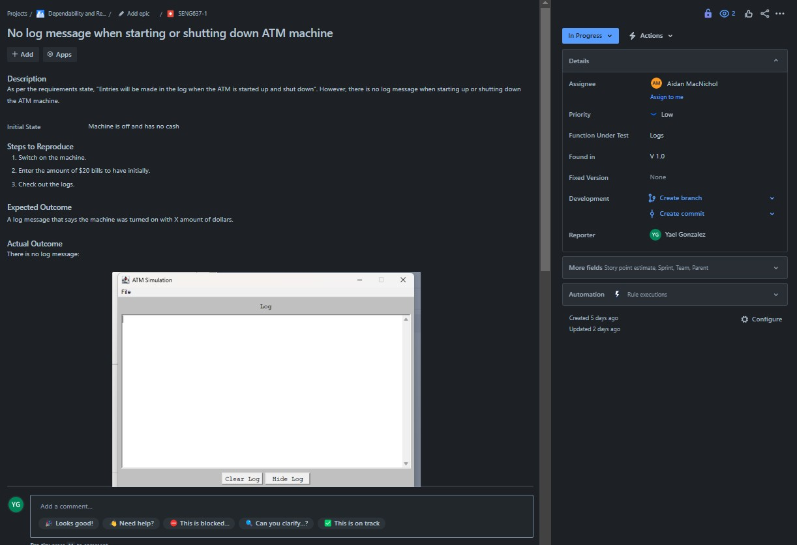

>   **SENG 637 - Software Testing, Reliability, and Quality**

**Lab. Report \#1 – Introduction to Testing and Defect Tracking**

| Group: Group Number      |
|-----------------|
| Student 1: Aidan MacNichol |   
| Student 2 David Pozniak |   
| Student 3 Bailey Collinson |   
| Student 4 Jorge Gonzalez Alcocer |   

**Table of Contents**

- [1 Introduction](#1-introduction)

- [2 High-level description of the exploratory testing plan](#2-high-level-description-of-the-exploratory-testing-plan)
    - [2.1 Scope of Testing](#21-scope-of-testing)
        - [2.1.1 Feature to be Tested](#211-feature-to-be-tested)
        - [2.1.2 Feature not to be Tested](#212-feature-not-to-be-tested)
    - [2.2 Test Type](#22-test-type)
    - [2.3 Test Logistics](#23-test-logistics)
        - [2.3.1 Who will Test?](#231-who-will-test)
        - [2.3.2 When will testing occur?](#232-when-will-testing-occur)
    - [2.4 Test Objective](#24-test-objective)
- [3 Comparison of exploratory and manual functional testing](#3-comparison-of-exploratory-and-manual-functional-testing)
- [4 Notes and discussion of the peer reviews of defect reports](#4-notes-and-discussion-of-the-peer-reviews-of-defect-reports)
- [5 How the pair testing was managed and team work/effort was divided](#5-how-the-pair-testing-was-managed-and-team-workeffort-was-divided)
- [6 Difficulties encountered, challenges overcome, and lessons learned](#6-difficulties-encountered-challenges-overcome-and-lessons-learned)
- [7 Comments/feedback on the lab and lab document itself](#7-commentsfeedback-on-the-lab-and-lab-document-itself)
- [8 Appendix](#8-appendix) 

# 1 Introduction

This lab is meant as an introduction to testing. A simulated ATM System is used as the SUT. Three main types of testing are touched on: 
1. Exploratory testing
2. Manual scripted testing
3. Regression testing

# 2 High-level description of the exploratory testing plan

## 2.1 Scope of Testing

### 2.1.1 Feature to be Tested

The following table details the features that were tested. 

|Module Name|Applicable Roles|Description|
|----------------------------------|----------------------------------|------------------------------------------------------------------------------------------------------------------------------------------------------------------------------------------------------------------------------------------------------------------------|
|Logs|Operator|The ATM will also maintain an internal log of transactions to facilitate resolving ambiguities arising from a hardware failure in the middle of a transaction.|
|Balance Inquiry|Customer|A customer must be able to make a balance inquiry of any account linked to the card.|
|Session|Customer|Session is limted to only the specified functionality and nothing else, it is a negative test.|
|Transaction|Customer|The customer will then be able to perform one or more transactions, beable to cancel the transaction in the middle of the transaction process, and require pin reentry (if required) to proceed with the transaction.|
|Transfer|Customer|A customer must be able to make a transfer of money between any two accounts linked to the card.|
|Display Messages & Ticket Messages|Customer|The ATM will provide the customer with a printed receipt for each successful transaction, showing the date, time, machine location, type of transaction, account(s), amount, and ending and available balance(s) of the affected account ("to" account for transfers).|
|Withdrawal|Customer|A customer must be able to make a cash withdrawal from any suitable account linked to the card, in multiples of 20.00 dollar bills.|
|Authentication|Customer|A customer will be required to insert an ATM card and enter a Personal Identification Number (PIN) - both of which will be sent to the bank for validation as part of each transaction.|
|Deposit|Customer|A customer must be able to make a deposit to any account linked to the card, consisting of cash and/or checks in an envelope.|

### 2.1.2 Feature not to be Tested
Features that are not listed in the requirements are features that will not be included in the test plan. This includes: 
- Performance 
- Ease of use 
- Database connection 
- Security 

## 2.2 Test Type

For this system, the primary test types that were conducted were: 

**Exploratory Testing** – Based on a description of the system requirements, test cases were developed and tested for defects. 

**Manual Scripted Testing** – A provided test suite for the system was executed and any defects found were reported. 

**Regression Testing** – Using the same test suite provided from the manual scripted testing, a new version (1.1) was tested to see if any defects were resolved and if any new ones were created. 

For exploratory testing we included some negative tests to cover uncommon paths. We are missing, however, boundary testing and, besides what is encompassed during the functional tests, we are not testing for not doing any non-functional tests. 

Integration testing is somewhat simulated because we are looking at the bank answer (if the amount is being applied to the balance or not). We are also testing for the that the PIN is the correct one given the card number. We are not doing any API testing. UI testing is being simulated manually by entering keys in the ATM simulation system and looking at the prompts in the simulated screen. 

Ultimately, we are mainly focusing on functional end to end testing / system testing.   

## 2.3 Test Logistics

### 2.3.1 Who will test?

The table below shows the modules to be tested and their corresponding pair of testers. 

| **Feature**                        | **Team Pair** |
|------------------------------------|---------------|
| Logs                               | Aidan/Yael    |
| Balance Inquiry                    | Aidan/Yael    |
| Session                            | Aidan/Yael    |
| Transaction                        | Aidan/Yael    |
| Transfer                           | Aidan/Yael    |
| Display Messages & Ticket Messages | David/Bailey  |
| Withdrawal                         | David/Bailey  |
| Authentication                     | David/Bailey  |
| Deposit                            | David/Bailey  |

### 2.3.2 When will testing occur?
Testing occurs each time a new version of the software is released. All the existing functions along with any new additional functions will be tested following a robust test suite. 

## 2.4 Test Objective
The primary objective of the test plan is to verify the requirements of the ATM simulation system.  

- Identify and cover requirements outlined by the client (given text) 
    - Test each of the main features for the MVP 
- Identify and cover minimum requirements for the system 
    - Although not directly mapped by a Test Case, during our exploratory testing we are checking if the system is usable, such as: response time is reasonable, the system is intuitive to use, the system is reliable. 

# 3 Comparison of exploratory and manual functional testing

# 4 Notes and discussion of the peer reviews of defect reports

We found the peer review process to be helpful in doing defect reports. It was easier to spot bugs and record them with two pairs of eyes. Rating the “severity” of bugs was also another issue as different people had different opinions on what a particular bug should be rated as. We ended up following main tenets:  

1. Any bug marked “low priority” should be assumed that it might never get fixed. These should be extremely minor bugs that never really appear in the normal operation of the software.  

2. Any bugs marked “high priority” should be ones that can break the release of the software and are vital to fix before release 

3. If a bug does not fall into the two other categories it should be marked as “medium priority”  

Peer reviewing bug reports was also a good way to check that they are detailed enough, and the bugs can be reproduced from the given steps. We also made sure to include screenshots in our bug reports to further improve clarity.  

# 5 How the pair testing was managed and team work/effort was divided 

Our team of four was divided into two groups of two people. Each pair did half of the testing scope outlined in 2.3.1. In each pair one person performed the test while the other recorded. Halfway through the assigned tests each pair swapped roles so everyone could get experience with Jira.  

Tests were then re-verified by the pairs that did not conduct the initial test to verify the result.  

The report was written collaboratively as a group of four, making sure everyone reviewed each other's work.  

# 6 Difficulties encountered, challenges overcome, and lessons learned
Generally a lot of our issues and challenges were just from learning Jira. All of our group members were generally new to Jira and figuring out how everything works and processes like linking bug reports to test cases took a while to figure out. 

The biggest lesson we learnt was about staying organized and communicating well. Sometimes we ended up reporting the same bug or doing overlapping tests. This highlighted the importance of writing good test plans and communicating frequently in order to reduce repetitive work and increase team effeciency.  

# 7 Comments/feedback on the lab and lab document itself
Our biggest piece of feedback would be assignment clarity. We found it very confusing to get started and understand exactly what is expected of us. More clarity on deliverables in the assignment .md would decrease confusion in our opinion. 

# 8 Appendix
Our exploratory testing was done in pairs. An overview of all of the test cases found are shown below: 

While doing exploratory tesing was done, bugs that were found were appropriately recorded in Jira. The Excel file of bug reports exported from Jira can be found [HERE](report_media\BUG_REPORTS.xlsx)

**BUG REPORTS/DEFECTS**

**BUG REPORT 1**

**BUG REPORT 2**

**BUG REPORT 3**

**BUG REPORT 4**

**BUG REPORT 5**

**BUG REPORT 6**

**BUG REPORT 7**

**BUG REPORT 8**

**BUG REPORT 9**

**BUG REPORT 10**

**BUG REPORT 11**

**BUG REPORT 12**

