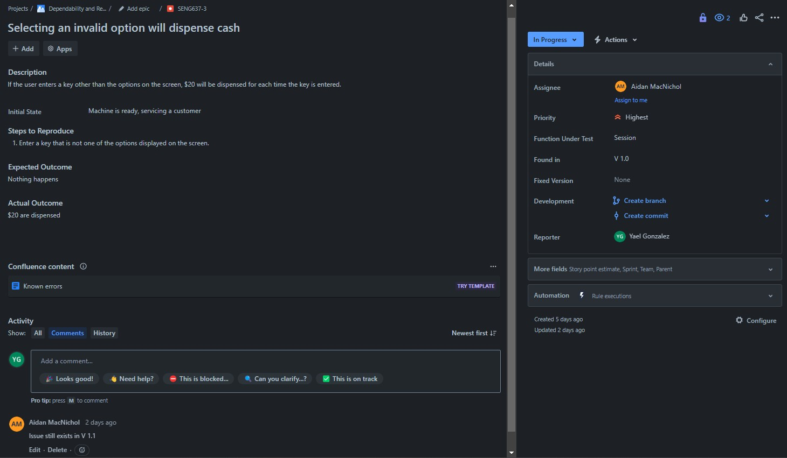

>   **SENG 637 - Software Testing, Reliability, and Quality**

**Lab. Report \#1 – Introduction to Testing and Defect Tracking**

| Group: Group Number 2 |
|-----------------|
| Student 1: Aidan MacNichol |   
| Student 2 David Pozniak |   
| Student 3 Bailey Collinson |   
| Student 4 Jorge Gonzalez Alcocer |   

**Table of Contents**

- [1 Introduction](#1-introduction)

- [2 High-level description of the exploratory testing plan](#2-high-level-description-of-the-exploratory-testing-plan)
    - [2.1 Scope of Testing](#21-scope-of-testing)
        - [2.1.1 Feature to be Tested](#211-feature-to-be-tested)
        - [2.1.2 Feature not to be Tested](#212-feature-not-to-be-tested)
    - [2.2 Test Type](#22-test-type)
    - [2.3 Test Logistics](#23-test-logistics)
        - [2.3.1 Who will Test?](#231-who-will-test)
        - [2.3.2 When will testing occur?](#232-when-will-testing-occur)
    - [2.4 Test Objective](#24-test-objective)
- [3 Comparison of exploratory and manual functional testing](#3-comparison-of-exploratory-and-manual-functional-testing)
- [4 Notes and discussion of the peer reviews of defect reports](#4-notes-and-discussion-of-the-peer-reviews-of-defect-reports)
- [5 How the pair testing was managed and team work/effort was divided](#5-how-the-pair-testing-was-managed-and-team-workeffort-was-divided)
- [6 Difficulties encountered, challenges overcome, and lessons learned](#6-difficulties-encountered-challenges-overcome-and-lessons-learned)
- [7 Comments/feedback on the lab and lab document itself](#7-commentsfeedback-on-the-lab-and-lab-document-itself)
- [8 Appendix](#8-appendix) 

# 1 Introduction

This lab is meant as an introduction to testing. A simulated ATM System is used as the SUT. Three main types of testing are touched on: 
1. Exploratory testing
2. Manual scripted testing
3. Regression testing

# 2 High-level description of the exploratory testing plan

## 2.1 Scope of Testing

### 2.1.1 Feature to be Tested

The following table details the features that were tested. 

|Module Name|Applicable Roles|Description|
|----------------------------------|----------------------------------|------------------------------------------------------------------------------------------------------------------------------------------------------------------------------------------------------------------------------------------------------------------------|
|Logs|Operator|The ATM will also maintain an internal log of transactions to facilitate resolving ambiguities arising from a hardware failure in the middle of a transaction.|
|Balance Inquiry|Customer|A customer must be able to make a balance inquiry of any account linked to the card.|
|Session|Customer|Session is limted to only the specified functionality and nothing else, it is a negative test.|
|Transaction|Customer|The customer will then be able to perform one or more transactions, beable to cancel the transaction in the middle of the transaction process, and require pin reentry (if required) to proceed with the transaction.|
|Transfer|Customer|A customer must be able to make a transfer of money between any two accounts linked to the card.|
|Display Messages & Ticket Messages|Customer|The ATM will provide the customer with a printed receipt for each successful transaction, showing the date, time, machine location, type of transaction, account(s), amount, and ending and available balance(s) of the affected account ("to" account for transfers).|
|Withdrawal|Customer|A customer must be able to make a cash withdrawal from any suitable account linked to the card, in multiples of 20.00 dollar bills.|
|Authentication|Customer|A customer will be required to insert an ATM card and enter a Personal Identification Number (PIN) - both of which will be sent to the bank for validation as part of each transaction.|
|Deposit|Customer|A customer must be able to make a deposit to any account linked to the card, consisting of cash and/or checks in an envelope.|

### 2.1.2 Feature not to be Tested
Any feature not explicitly stated in the requirements is excluded from the test plan. This includes: 
- Performance 
- Ease of use 
- Database connection 
- Security 

## 2.2 Test Type

For this system, the primary test types that were conducted were: 

**Exploratory Testing** – Using the system requirements as a guide, we designed and executed test cases to identify defects while exploring the system. This approach allowed for flexibility in discovering unexpected defects. 

**Manual Scripted Testing** – The predefined test suite was executed step-by-step, verifying specific functionalities and any defects found were documented. 

**Regression Testing** – The same test suite from manual scripted testing was applied to the simulated newer version (V 1.1) to confirm that previous defects were resolved and to detect any new bugs introduced in the update. 

In our exploratory testing, we incorporated negative tests to evaluate uncommon scenarios. However, we did not include boundary testing, and aside from what is covered within functional tests, we did not perform any non-functional testing (e.g., performance, security). 

Arguably, integration testing was partially simulated by verifying the bank’s response, such as whether transactions correctly affected account balances and whether PIN validation worked as expected. However, API testing was not conducted. 

Overall, our testing primarily focused on functional, end-to-end system testing to validate main features and user interactions   

## 2.3 Test Logistics

### 2.3.1 Who will test?

The table below shows the modules to be tested and their corresponding pair of testers. 

| **Feature**                        | **Team Pair** |
|------------------------------------|---------------|
| Logs                               | Aidan/Yael    |
| Balance Inquiry                    | Aidan/Yael    |
| Session                            | Aidan/Yael    |
| Transaction                        | Aidan/Yael    |
| Transfer                           | Aidan/Yael    |
| Display Messages & Ticket Messages | David/Bailey  |
| Withdrawal                         | David/Bailey  |
| Authentication                     | David/Bailey  |
| Deposit                            | David/Bailey  |

### 2.3.2 When will testing occur?
Testing occurs each time a new version of the software is released. All the existing functions along with any new additional functions will be tested following a robust test suite. 

## 2.4 Test Objective
The primary objective of this test plan is to validate the ATM simulation system against its defined requirements. Our main goals include: 

- Ensuring all requirements outlined by the client are tested and verified. 
- Identifying and verifying the minimum functional requirements for system operation. 

Beyond formal test cases, our exploratory testing also assesses system usability by considering: 

- Response time – Ensuring transactions are processed within a reasonable time. 
- Ease of use – Verifying that the system is intuitive for users. 
- Reliability – Checking for system stability and consistent performance. 

These aspects were not formally documented but were considered during exploratory testing, making them subjective evaluations rather than structured test cases. 

# 3 Comparison of exploratory and manual functional testing
For the ATM simulation system exploratory testing was done by utilizing the high-level system requirements to develop general test cases that are used to detect defects in the system. This approach allowed for a more dynamic approach to testing the system, while prioritizing finding bugs over formal documentation. Exploratory testing seems to be more efficient when it comes to detecting unexpected issues because the processes can be adapted in real time based on specific outcomes. Another benefit of exploratory testing is that it better mirrors how an actual user may use the software and can help identify key “pain points” or confusion. 

In contrast, manual scripted testing (MST) followed a structured test suite that defined specific inputs, conditions, and expected outcomes. This step-by-step approach provided consistency and standardization, ensuring all required functionalities were validated. MST was particularly effective in verifying requirement-driven behaviors, which also reduced ambiguity in test execution. 

As documented in our exported bug report [HERE](report_media/BUG_REPORTS.xlsx), we found: 

6 bugs during exploratory testing:
-  (SENG637-1, SENG637-2, SENG637-3, SENG637-4, SENG637-5, SENG637-8) 

5 bugs during manual functional testing:
- (SENG637-6, SENG637-7, SENG637-9, SENG637-10, SENG637-11) 

1 bug during regression testing:
-  (SENG637-12) 

The fact that most bugs were detected through exploratory testing suggests that this approach was particularly effective in uncovering defects beyond predefined test cases. However, the 5 bugs caught during MST demonstrate that exploratory testing alone is not sufficient, as some issues were only found through structured testing. Also, having a standardized step-by-step approach also proved helpful to identify new defects during regression testing. 

Some important observations we identified by working on this assignment and while comparing the types of testing were: 

- The value of diverse testers – Test plans and test cases benefit from multiple reviewers. Different testers approach the same feature differently, for example, while testing the "transfer" functionality, some focused on messaging accuracy, while others prioritized transaction validation and allowable amounts. Having multiple perspectives helped ensure broader coverage while detecting bugs and validating the system. 

- Exploratory testing uncovered more negative Test Cases – Certain bugs, such as SENG637-3 ("Selecting an invalid option will dispense cash"), were found only during exploratory testing, not MST. This suggests that MST adheres strictly to predefined requirements, making it effective at detecting requirement-related bugs, while exploratory testing may better simulate real-world user interactions and identify edge cases. 

- Regression Testing validates fixes and catches new issues – During regression testing on MST test cases, we observed that some bugs from Version 1.0 were successfully fixed in Version 1.1. However, regression testing also helped identify new bugs introduced in V1.1, such as “SENG637-12 RT: Typo in withdrawal menu for $60” reinforcing its importance in ensuring that bug fixes do not introduce new defects. 

These observations ultimately emphasize the importance of having a balanced and diverse approach while testing a system by combining multiple test methods.  

# 4 Notes and discussion of the peer reviews of defect reports

We found the peer review process to be helpful in doing defect reports. It was easier to spot bugs and record them with two pairs of eyes. Rating the “severity” of bugs was also another issue as different people had different opinions on what a particular bug should be rated as. We ended up following main tenets:  

1. Any bug marked “low priority” should be assumed that it might never get fixed. These should be extremely minor bugs that never really appear in the normal operation of the software.  

2. Any bugs marked “high priority” should be ones that can break the release of the software and are vital to fix before release 

3. If a bug does not fall into the two other categories it should be marked as “medium priority”  

Peer reviewing bug reports was also a good way to check that they are detailed enough, and the bugs can be reproduced from the given steps. We also made sure to include screenshots in our bug reports to further improve clarity.  

# 5 How the pair testing was managed and team work/effort was divided 

Our team of four was divided into two groups of two people. Each pair did half of the testing scope outlined in 2.3.1. In each pair one person performed the test while the other recorded. Halfway through the assigned tests each pair swapped roles so everyone could get experience with Jira.  

Tests were then re-verified by the pairs that did not conduct the initial test to verify the result.  

The report was written collaboratively as a group of four, making sure everyone reviewed each other's work.  

# 6 Difficulties encountered, challenges overcome, and lessons learned
Generally a lot of our issues and challenges were just from learning Jira. All of our group members were generally new to Jira and figuring out how everything works and processes like linking bug reports to test cases took a while to figure out. 

The biggest lesson we learnt was about staying organized and communicating well. Sometimes we ended up reporting the same bug or doing overlapping tests. This highlighted the importance of writing good test plans and communicating frequently in order to reduce repetitive work and increase team effeciency.  

# 7 Comments/feedback on the lab and lab document itself
Our biggest piece of feedback would be assignment clarity. We found it very confusing to get started and understand exactly what is expected of us. More clarity on deliverables in the assignment .md would decrease confusion in our opinion. 

# 8 Appendix
Our exploratory testing was done in pairs. An overview of all of the test cases found are shown below: 

While doing exploratory tesing was done, bugs that were found were appropriately recorded in Jira. The Excel file of bug reports exported from Jira can be found [HERE](report_media/BUG_REPORTS.xlsx)

**BUG REPORTS/DEFECTS**

**BUG REPORT 1**

**BUG REPORT 2**

**BUG REPORT 3**

**BUG REPORT 4**

**BUG REPORT 5**

**BUG REPORT 6**

**BUG REPORT 7**

**BUG REPORT 8**

**BUG REPORT 9**

**BUG REPORT 10**

**BUG REPORT 11**

**BUG REPORT 12**

